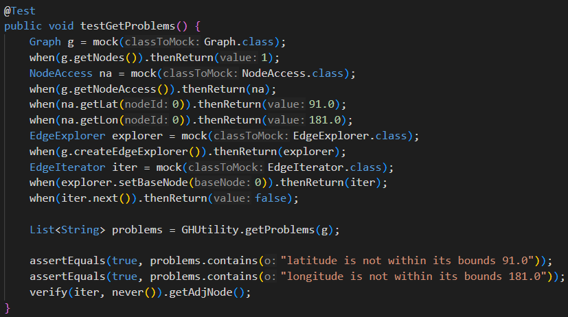
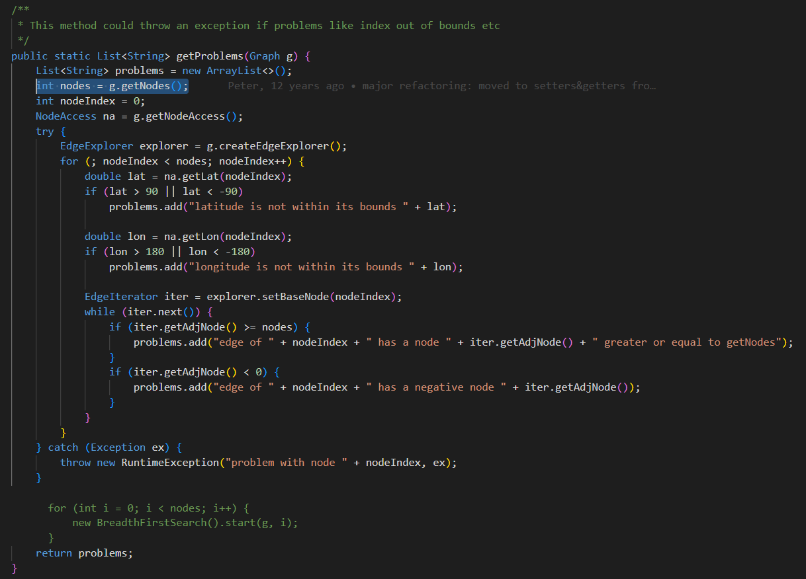
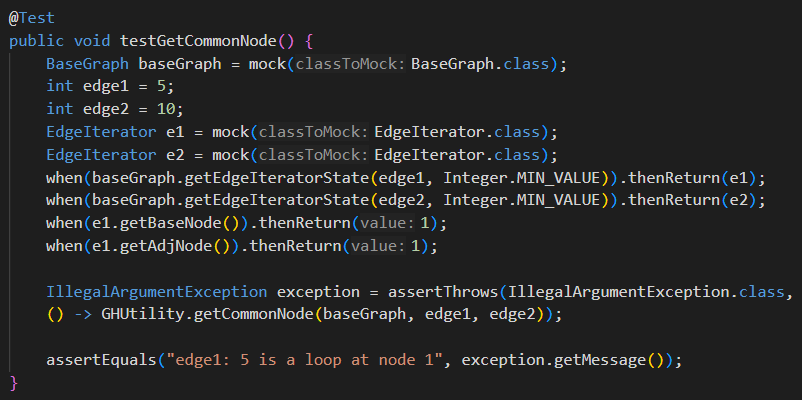
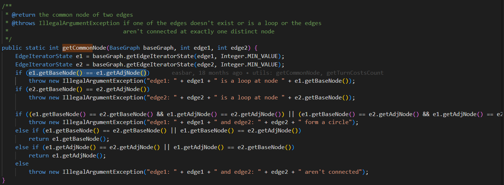

# Modification du workflow

Nous avons fait un autre fichier ```pitest.yml``` qui test le pitest. Le workflow ```pitest.yml``` éxécute des lines de commande pour éxécuter les test de mutation pitest. L'extraction du mutation score se fait avec un grep.  Ensuite, on compare avec le score précédent s'il existe. Si le score est plus bas que le précédent alors on échoue le test et on est invité de regarder un tutoriel (rickroll). Sinon le test passe et on enregistre le score dans un fichier mutation-score.txt. 
```
Run CURRENT=3
Previous score: 4%
Current score: 3%
Error: ❌ Mutation score decreased from 4% to 3%
Warning: 📺 Don't give up! Check this tutorial: https://www.youtube.com/watch?v=dQw4w9WgXcQ
Error: Process completed with exit code 1
```
Pour éviter de rouler le build quand le test de mutation est plus bas que le commit précédent nous avons ajouté dans ```build.yml```: 
```
on: 
  workflow_run:
    workflows: ["Mutation Testing"]
    types: 
      - completed
jobs:
  build:
    if: ${{github.event.workflow_run.conclusion == 'success'}}
```
Comme ça le build attend que le workflow pitest est fini et est (successful) avant de rouler le workflow ```build.yml```. 

# Mocks
La classe GHUtility a été choisie, car elle contient des fonctions qui ne sont pas couvertes par des tests comme on peut voir dans le rapport jacoco du code. Les fonctions non couvertes contenant des classes non ‘primitives’ de java et ‘propres’ à GraphHopper ont été choisies pour faire des tests. 
Ces classes non primitives de java pour lesquelles il est moins facile de créer un instance à cause de leurs plusieurs dépendances ont été simulées afin de pouvoir se concentrer davantage sur tester la logique dans des fonctions testées et de réduire les dépendances sur les autres classes.

Ainsi, Graph, NodeAccess, EdgeExplorer et EdgeIterator dans getProblems ont été mockés [ex: `Graph g = mock(Graph.class)`]: 
et les valeurs de retour de leurs fonctions utilisées dans getProblem ont aussi été mockées par exemple avec `when(g.getNodes()).thenReturn(1)`, car g.getNodes() est utilisé dans `int nodes = g.getNodes()`: 


Même chose pour BaseGraph et EdgeIterator dans getCommonNode  [ex: `BaseGraph baseGraph = mock(BaseGraph.class)`]:  
et les valeurs de retour de leurs fonctions qui sont utilisées dans getCommonNode par exemple avec `when(e1.getBaseNode()).thenReturn(1)` et `when(e1.getAdjNode()).thenReturn(1)`. 

Sans ces valeurs de retour simulées, les tests ne fonctionneraient pas, car ça retournerait une valeur nulle avec les mocks.